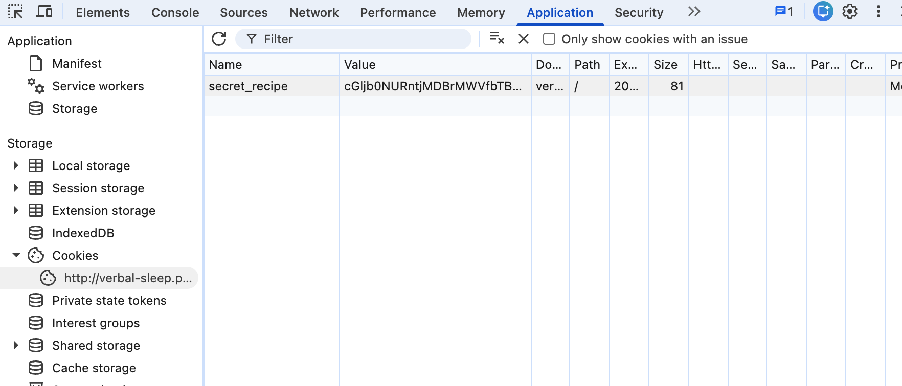

---
tags:
  - Web
  - picoCTF
---

# Cookie Monster Secret Recipe

## 問題
- **プラットフォーム / CTF**: picoCTF
- **カテゴリ**: Web
- **難易度**: Easy
- **リンク**: https://learn.cylabacademy.org/library/469?page=1
- **説明**: Cookie Monster has hidden his top-secret cookie recipe somewhere on his website. As an aspiring cookie detective, your mission is to uncover this delectable secret. Can you outsmart Cookie Monster and find the hidden recipe?

## 使った技術・脆弱性
<!-- 使った脆弱性・手法を箇条書きで -->

## 解答までの道筋
誘導されている通り、cookieを確認してみる。

secret_recipe: cGljb0NURntjMDBrMWVfbTBuc3Rlcl9sMHZlc19jMDBraWVzX0M0MzBBRTIwfQ==
`==`で終わってるので、base64が怪しい
```
╰─ base64 -d
cGljb0NURntjMDBrMWVfbTBuc3Rlcl9sMHZlc19jMDBraWVzX0M0MzBBRTIwfQ==
picoCTF{c00k1e_m0nster_l0ves_c00kies_C430AE20}
```

## 決め手 / つまずいた点
<!-- 思考プロセスを言語化 -->

## 学んだこと

## 参考
-
