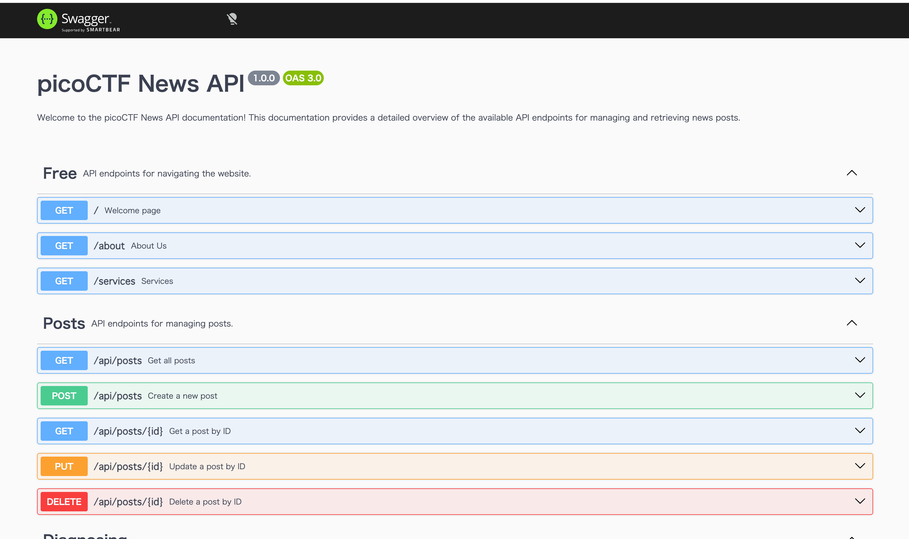
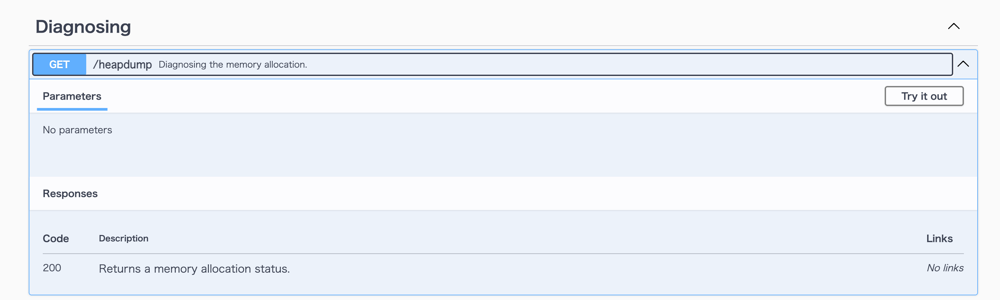

---
tags:
  - Web
  - picoCTF
---

# head-dump

## 問題
- **プラットフォーム / CTF**: picoCTF
- **カテゴリ**: Web
- **難易度**: Easy
- **リンク**: https://learn.cylabacademy.org/library/476?page=1
- **説明**: The application is a simple blog website where you can read articles about various topics, including an article about API Documentation. Your goal is to explore the application and find the endpoint that generates files holding the server’s memory, where a secret flag is hidden.

## 使った技術・脆弱性
<!-- 使った脆弱性・手法を箇条書きで -->

## 解答までの道筋
curl -I http://verbal-sleep.picoctf.net:56097/ これを叩いたらバックエンドがExpressでじっそうされてることがわかった。
問題文にapiドキュメントに誘導するような表現があるので、従ってみる
SwaggerというAPIがよくつかわれているらしい。エンドポイントは/api-docs->ビンゴ

heapdumpがあやしい

アクセスしたらheapsnapshotっていうのが手に入った。
メモリダンプから印字可能文字列を拾う時にstringsコマンドっていうのが使えるらしい
```
╰─ strings ~/Downloads/heapdump-1783676493657.heapsnapshot | grep -ao 'picoCTF{[^}]*}'
picoCTF{Pat!3nt_15_Th3_K3y_dc0756a3}
```

## 決め手 / つまずいた点
<!-- 思考プロセスを言語化 -->
隠れたエンドポイント見つける方法がわからなかった。よくあるパターンを総当たりで試すツールとかがあるのかと思い調べたが、まずはjsやサイトマップ等から推測する方法が推奨されてるようだった。
レスポンスヘッダーから、バックエンドがExpress実装になっていることがわかったことと、swaggerが使われているだろうという推測から/api-docsを試せたことが決め手


## 学んだこと
- Burp Suiteっていうの使ったり、ディレクトリブルートフォースをしたりすれば機械的に検出も可能らしい。
- `v8.writeHeapSnapshot();` nodeのメモリダンプができる。

## 参考
- https://cysec148.hatenablog.com/entry/2025/03/19/062427
